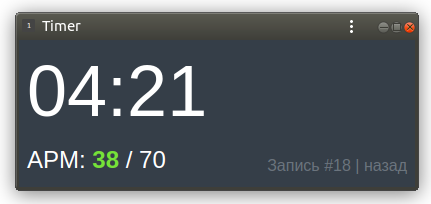

Таймер и индикатор APM со свои веб-API и кроссплатформенным клиентом кей-логгером.




## Как запустить

Установите зависимости:

```
pip install -r requirements.txt
```

Проект настраивается через переменные окружения. Указывать их не обязательно. Доступные настройки:

```sh
DATABASE_URL='sqlite:////home/user/db.sqlite3'
DEBUG=YES
SECRET_KEY='5hv@(79%2b-u*rvq1@yr%=$(8kpr7y!#16jmi!prlxfh%kd*%m'
```

Переменная `DATABASE_URL` имеет формат, описанный в документации к [dj-database-url](https://github.com/jacobian/dj-database-url).

Перед запуском сайта инициализируйте базу данных:

```sh
python3 manage.py migrate
```

Осталось запустить разработческий веб-сервер:

```sh
python3 manage.py runserver
```

Сайт откроется по адресу [127.0.0.1:8000](http://127.0.0.1:8000).

## Как создать web app

Окно сайта можно запустить в отдельном окне, воспользовавшись функцей Chrome Create Shortcut. Работает на всех популярных ОС включая Ubuntu. [Как сделать](https://www.laptopmag.com/articles/how-to-create-desktop-shortcuts-for-web-pages-using-chrome).

Окно таймера можно уменьшить в размере и закрепить поверх остальных окон. В Linux Gnome для этого нужно зажать <kbd>Win+Mouse Right Click</kbd>, затем в выпадающем меню выбрать опцию `Always on visible Wokspace`.

## TODO

- Нужна защита от слишком долгих реплеев, под завязку забивающих СУБД
- Нужна защита от DoS — тысяч событий в секунду
- Рассчитать нагрузку на БД и подумать над заменой СУБД на NoSQL
- Зафиксировать App на рабочем столе
- Deploy на prod сервер с использованием AWSGI
- Добавить кнопки управления таймеров — запустить, пауза, остановить